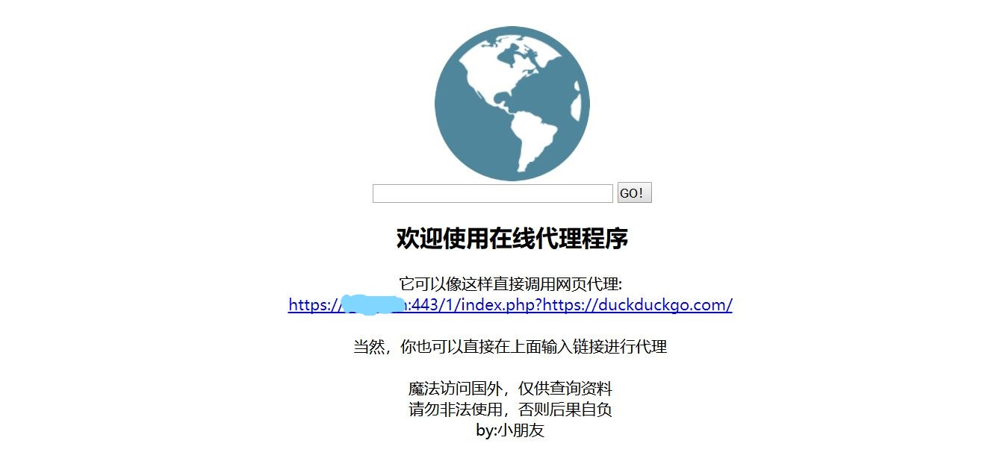

# miniProxy-embellish
在线web代理miniProxy的界面美化版，简洁大方适应手机

### 与miniProxy不同点：
* 没什么不同，就是改了下显示界面，简洁大方适应手机
* 还有就是默认跳转改成duckduckgo.com，即鸭鸭走搜索引擎，不比谷歌差，而代理谷歌的话容易出现验证。

### 原由
在线代理这个东西理解起来也很简单，就是一个基于web架构的程序。
很多时候，其实我们也就是想谷歌搜索一下，查点资料，没必要搞一个服务器搭建SSR，只需要部署一个简单代理即可，这个时候就可以使用miniProxy。
前几天黑五的时候0.5刀买了个虚拟主机，就想着用miniProxy做个web代理，没想到那个界面太丑了，就照着美化了一下。

### 准备条件：
一台国外的服务器（推荐香港）、一个能正常打开PHP页面的WEB环境或者虚拟主机。

### 安装办法：
和miniProxy一样用法，上传程序到主机，打开地址即可。

### 注意事项：
web代理这种一定要给网站上https，即ssl

### 联系方式:
* 邮件(coolslf#qq.com, 把#换成@)，不要惹小朋友。

我的网站链接就不放了，不然被群里大佬发现￢o(￣-￣ﾒ)
啥，你说 Markdown 语法？不听不听我不听

